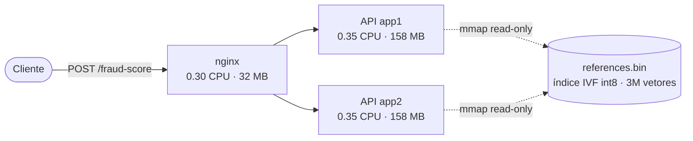
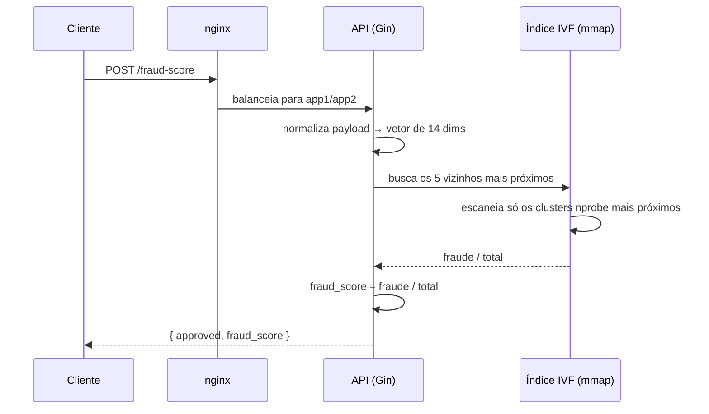
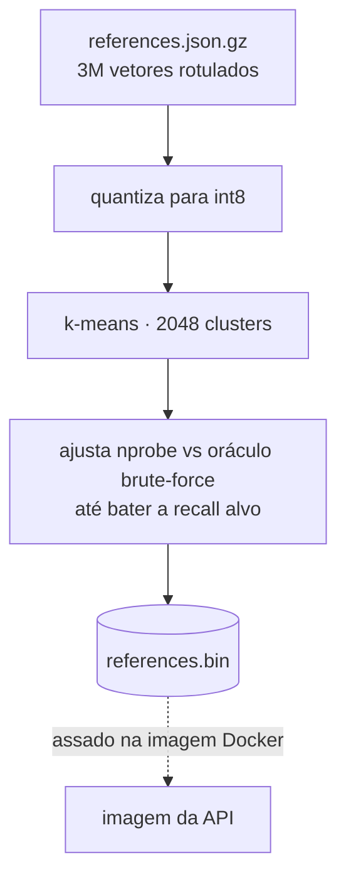

# Fraud Detection — Rinha de Backend 2026

Detecta fraude em transações. Sem banco de dados. Cabe em 1 CPU e 350 MB.

Repositório da rinha disponível [aqui](https://github.com/zanfranceschi/rinha-de-backend-2026/).

## A ideia

Para cada transação, achamos as **5 transações de referência mais parecidas** entre 3 milhões. Se 60% ou mais delas forem fraude, a transação é rejeitada. Só isso.

```
fraud_score = vizinhos_fraude / total_vizinhos
aprovada    = fraud_score < 0.6
```

## Por que não tem banco

Limites da Rinha não permitem. As 3 milhões de referências viram um índice vetorial IVF, quantizado em int8, e são **assadas dentro da imagem Docker** (`references.bin`). Em runtime cada instância faz `mmap` do arquivo read-only — fora do heap do Go, compartilhado entre instâncias. Postgres + pgvector já estiveram aqui. Foram embora.

## Como funciona

1. A transação vira um vetor de 14 dimensões (valor, parcelas, hora, distância de casa, MCC, etc).
2. Buscamos os vizinhos mais próximos no índice IVF (escaneia só os clusters mais próximos, não os 3M).
3. Contamos quantos são fraude. Decidimos.

## Arquitetura

Dois processos da API atrás de um nginx. Sem banco, sem cache externo, sem fila. O orçamento inteiro é 1 CPU e 350 MB — então cada peça tem dono.



O `references.bin` está assado dentro da imagem. As duas instâncias mapeiam a mesma camada — as páginas vivem fora do heap do Go e são compartilhadas.

### O caminho de uma requisição



### O índice (build time)

Roda uma vez, na construção da imagem. Nunca no caminho da requisição.



## Rodando

```sh
docker compose up
```

Sobe nginx + 2 instâncias da API. Sem mais nada.

```sh
curl -X POST http://localhost:9999/fraud-score \
  -H 'content-type: application/json' \
  -d @transaction.json
```

Resposta:

```json
{ "approved": true, "fraud_score": 0.2 }
```

## Construindo o índice

Roda uma vez, em build time. Baixa o dataset, quantiza, clusteriza, ajusta o `nprobe` sozinho até bater a recall alvo, e grava o binário.

```sh
go run ./cmd/preprocess -output references.bin
```

## Stack

Go + Gin. nginx na frente. Índice vetorial escrito à mão com kernels AVX2. É isso. 

Feito com ajuda do Claudio Opus 4.8 Effort High.

Aprendi muito, obrigado!

---
<div align="center">
  
</div>
